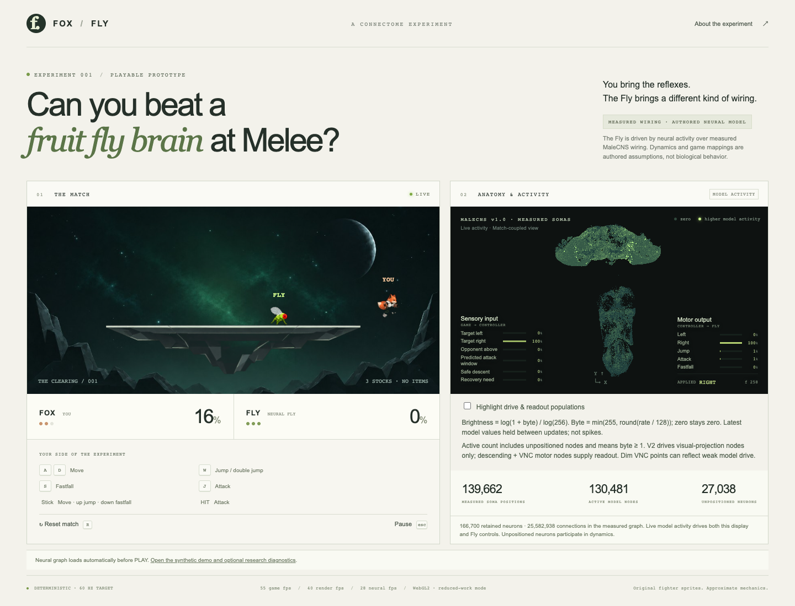
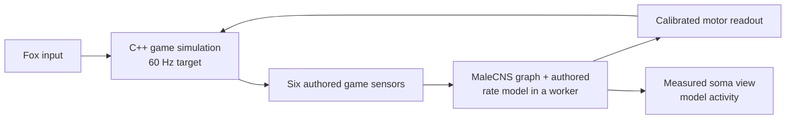

<div align="center">

# FOX / FLY

[](https://github.com/gabinacode/fox-vs-fly/actions/workflows/ci.yml)


### Can you beat a fruit fly brain at Melee?

A playable fighting-game experiment where you control Fox and a modeled neural circuit controls Fly.

**[Play in your browser](https://fox-vs-fly.pages.dev/)** · **[How it works](#how-it-works)** · **[Run it locally](#run-it-locally)**

</div>



<sub>Local Chrome capture: the match, live model activity, and measured anatomy in one view.</sub>

The Fly's controller runs an authored rate model over the **MaleCNS v1.0** wiring graph: **166,700 neurons** and **25,582,938 directed connections**. The adjacent view plots **139,662 measured soma positions** and the model's current activity. The game is a deterministic C++ simulation compiled to WebAssembly, with a React interface and WebGL brain renderer.

> **Research boundary:** The wiring and soma coordinates come from measured data. Neural dynamics, game sensors, input assignments, readout, and fighting behavior are engineered for this experiment. The Fly has not learned Melee, and the game does not claim to reproduce biological fly behavior or Melee mechanics exactly.

## Play

Open the **[live game](https://fox-vs-fly.pages.dev/)** in Chrome. The first visit downloads about **76 MiB** of compressed connectivity; **PLAY** becomes available after the graph is checked and prepared. No account or installation is needed.

| Action | Keyboard | Phone |
| --- | --- | --- |
| Move | `A` / `D` | Left stick |
| Jump / double jump | `W` (tap for a short hop) | Stick up |
| Fastfall | `S` while descending | Stick down |
| Attack | `J` | **HIT** |
| Pause / reset | `Esc` / `R` | — |

You have three stocks. Knock Fly past the stage boundaries before it does the same to you. The explicit [`?controller=dummy`](https://fox-vs-fly.pages.dev/?controller=dummy) route is a lightweight **synthetic demo**; its activity is labeled as synthetic in the UI.

## How it works



- **One simulation across runtimes.** Native C++ and browser WASM share deterministic game rules. Rendering never advances the game state.
- **Measured structure, modeled response.** The controller uses the retained MaleCNS graph; its 30 Hz rate dynamics and game interface are explicit assumptions. The values shown in the motor panel are the values applied to Fly.
- **Anatomy you can inspect.** WebGL plots positioned somas; neurons without coordinates still participate in the model. A Canvas fallback is available.
- **Original presentation.** The stage, fighter sprites, and capture visuals are project art. Nintendo assets, game files, Dolphin, and reference projects are not player or browser dependencies.

The simulator implements a focused set of platform-fighter mechanics, including movement, jumps, attacks, damage, knockback, stocks, and respawn. Its Melee fidelity is documented as [partial or approximate](docs/MELEE_PORT.md).

## Run it locally

Developer prerequisites: **CMake 3.20+**, a **C++17 compiler**, **Node 22.12+**, **Python 3**, **Emscripten 4.0.15**, and **Chrome** for browser tests.

```sh
npm --prefix web ci
python3 -m venv .venv
.venv/bin/python -m pip install -r brain/preprocess/requirements.txt
# Activate Emscripten 4.0.15, or set EMSDK to its SDK directory.
./scripts/build_wasm.sh
npm --prefix web run dev -- --port 5173 --strictPort
```

Open `http://127.0.0.1:5173/`. The full connectivity binaries are **not stored in Git**. A default neural game needs the processed graph or a restored packaged graph; [data/README.md](data/README.md) explains how to prepare it. For UI and synthetic-controller work, use `/?controller=dummy`.

Run the complete native, neural, WASM, frontend, and browser checks with:

```sh
./scripts/verify.sh
```

To produce a static site, run `./scripts/build_wasm.sh` and `npm --prefix web run build`, then serve the entire `web/dist/` directory over HTTP(S). Players need no account, ROM, separate scientific data download, or external runtime service. The graph assets still need to be present during the build.

## Evidence and project notes

| Topic | Details |
| --- | --- |
| Architecture and runtime | [Architecture](docs/ARCHITECTURE.md) · [Graph loading](docs/GRAPH_LOADING.md) |
| Data provenance and scientific limits | [MaleCNS sources](docs/FLY_CONNECTOME.md) · [Controller model](docs/NEURAL_GAMEPLAY.md) |
| Game fidelity and evaluation | [Melee reference audit](docs/MELEE_PORT.md) · [Match evaluation](docs/MATCH_EVALUATION.md) |
| Visuals and reproducible capture | [Activity display](docs/ACTIVITY_DISPLAY.md) · [Gameplay capture](docs/CAPTURE.md) · [Cinematic](docs/CINEMATIC.md) |
| Ongoing work | [Progress and known limitations](docs/PROGRESS.md) · [Benchmarks](docs/BENCHMARKS.md) |

The separate cinematic uses **synthetic activity over measured geometry** and is labeled accordingly. Gameplay capture uses the live controller's activity. Source snapshots and numerical assumptions are recorded in the linked docs. This repository does not ship Nintendo assets or disc images.
